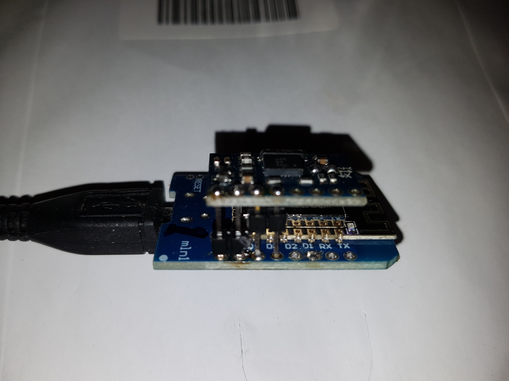
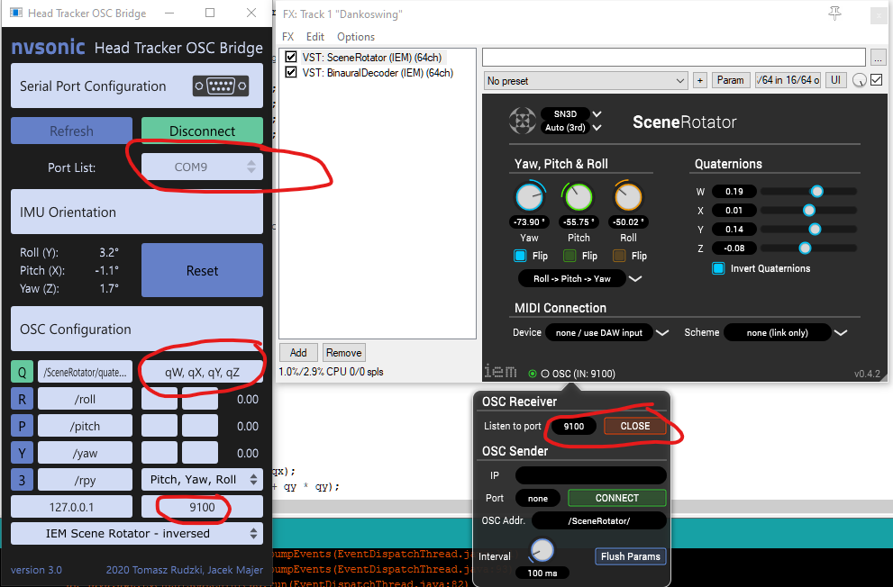

# OHTI-HT-osc-wifi

 What is OHTI-HT  (Open Head Tracker Implementation), it is a result of the effort to create a low cost HT solution. 

ToDo
--------
Add LED indication of calibration stage! (Steady light , then fast flashes?)! - Done, in a way.

Store and reload BNO055 Calibration over PowerOff in program flash! -Not Yet

The OSC port for UDP broadcast is fixed at 9000, make it configurable? -NO

Add OSC support over websocket to control Omnitone webplayer? done fetch for windows 10 www.ohti.xyz://OHTI-OSC-Receiver-msgpack-1.2.exe.zip

Do not send any OSC message if the headtracker is stationary, might save power?

Make it possible to control the ohti web based player with this HT - Done
http://www.ohti.xyz/ohti/index_osc_omnitone.html?socketurl=localhost&socketport=8080
Design choices: 
-------------------------
Originally BNO055 IMU was used to minimize the programming effort and cpu load.
Several versions of headtracker message protocols have been tried.
OSC WiFi UDP is chosen for this version, only drawback is the current consumption of the WiFi communication.

Currently the OSC message is configured to use the message syntax of the IEM SceneRotator VST.

The support of OSC message for IEM Spatial Rotator is a good combination with the IEM binaural decoder with SOFA support on Reaper DAW.

OSC with quaternions carry the directional info, this to simplify the directional reset calculations and avoid gimbal lock.

The low cost HW solution is Wemos D1 mini ( esp8266 chinese module) and chinese GY-BNO055 with external crystal.
- 4 connections needs to be soldered between the 2 modules, I have used Aliexpress as hw supplier.

For a no solder solutions the QUIIC system and bno080 and esp8266 from sparkfun can be used.

This is the references that explains how I was able to Simplify the conntions between the modules to use 4 straight pinsa as interconnection.
```
https://forum.arduino.cc/index.php?topic=427607.15 
Info on Pin Remapping with Wire.begin()

ESP12-F pinout
https://www.pinterest.de/pin/115193702951946398/    

Adafruit BNO055 pinout 
https://learn.adafruit.com/adafruit-bno055-absolute-orientation-sensor/pinouts

Pinout of Chinese module GY-BNO055:
Uses chip: BNO-055
Power supply: 3-5v (internal low voltage regulator)
Communication method: standard IIC / serial communication protocol
Communication: Module size 12mm * 20mm

Arduino config to simplify connection (for Soldering or connectors) between 8266 D1 and BNO055 modules,
when 4 straight pins soldered to bot modules BNO055 will be around 12 mm above the D1 mini. 

How to Remap the SCL and SDA to different GPIO pins depending on IMU module pinout.
For GY-BNO055 4 straight pins are used, If Adafruit bno055 is used 1 connection needs to be a wire to connect the 5 volt positions.
Wire.begin(0,2);       // for Chinese GY-BNO055      -  4 straight connection pins
Wire.begin(2,0);       // for Adafruit BNO055 module -  3 pins + one cable

GY-BNO055.                Adafruit BNO055.        Wemos D1 mini
                          -- Vin 5v             -\                 
-- Vin  5 - 3.3v          NoCon. Vin 3.3v           -- Vout   5v Powered by USB
-- GND.                   -- GND.                   -- GND
-- SCL  GPIO2.            -- SDA GPIO0.             -- D4 - Assign in Wire.begin 
-- SDA  GPIO0.            -- SCL GPIO2.             -- D3 - Assign
   ADD                                                 NoCon
   Int
   Boot
   Reset

https://forum.arduino.cc/index.php?topic=427607.15 
Info on Pin Remapping with Wire.begin()
```

Setup
---------
At initial power up or if the previously configured network is unreachable, enter the credentials to use a available WiFi network:

Connect a computer to the wifi network OHTI AP.
Access the webpage, Use Firefox or Opera connect to http://192.168.4.1 ,
Chrome tries to connect to google so you possibly do not get the setup buttons. In some cases you are even disconnected from OHTI-AP.
Enter the credentials for the local WiFi network to use.

Click the save ... button, after the storage of the credentials the OHTI HT will reset and connect to the chosen wifi network.

If the configured network is not available at power on the OHTI-AP will be started, allowin connection to other WiFi net.

Power the OHTI-HT by a usb power bank, this is a suggestion if you do not power it from your computer. The power bank can be put in a pocket or at your belt.

Usage
----------
After power on:
If you want to see what is going on during boot and calibration, connect to the usb serial port with for example Termite (on windows)

During HW initilization the blue LED will be lit, when it is turned off KEEP the OHTI-HT still on flat surface.

Calibration procedure - wait 30 seconds after power on with sensor still in horizontal position or until Blue Led starts blinking.
Next step, MOVE sensor in a FIGURE of EIGHT in a vertical direction with usb cable connector as rotational center for about 20 seconds until the LED lights up.

With the updated release nvsonic Headtracker OSC Bridge V3 can be used as a bridge from serial to OSC on local windows host.
This gives a button for direction reset and other options.

For 
<p align="center">
  </p>
  Simplified Interconnectivity Between BNO055 and esp8266 D1 mini.
  
<p align = "center">

</p>

